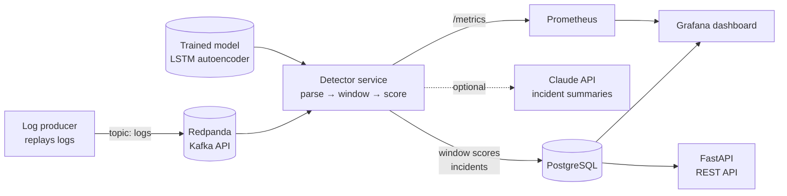

# LogSentinel

**Real-time log anomaly detection.** LogSentinel streams application logs through Kafka, groups them into one-minute windows, scores each window with an LSTM autoencoder, and turns anomalies into incidents with plain-English explanations. It includes optional LLM-written summaries, a REST API, and live Grafana dashboards.

The motivation is a limitation of classic alerting. A fixed rule such as *"alert when more than X% of lines are errors"* is blind to incidents that do not produce errors: a retry storm, a credential-stuffing attack, or a service that silently crashes. LogSentinel learns what normal log behaviour looks like and alerts on deviations from it.


## Results

Benchmark on synthetic microservice logs: 48 h healthy training period, 24 h validation, 24 h test with 12 incidents of 6 types (about 880,000 log lines in total). Every model's alert threshold is tuned on the validation day, then measured once on the unseen test day.

| Model | Precision | Recall | F1 | ROC-AUC | Incidents caught | Avg. delay (min) | False alarms/day |
|---|---:|---:|---:|---:|---:|---:|---:|
| Static error-rate threshold | 0.85 | 0.44 | 0.58 | 0.774 | 8/12 | 2.2 | 9 |
| Isolation Forest | 0.40 | 0.64 | 0.49 | 0.878 | 11/12 | 1.5 | 88 |
| Isolation Forest + novelty rule | 0.46 | 0.85 | 0.60 | 0.878 | 12/12 | 0.9 | 88 |
| **LSTM Autoencoder** | **0.95** | **0.91** | **0.93** | **0.965** | **12/12** | **0.8** | **4** |

Reproduce with `logsentinel evaluate --dataset synthetic` (fixed seed, about 2 minutes on a laptop CPU).

**Key findings**

- **The static threshold missed every retry storm and credential-stuffing attack (0/4).** Those incidents produce warnings, not errors, so an error-rate rule cannot see them, however it is tuned.
- **The Isolation Forest caught incidents but raised 88 false alarms per day**, which would cause alert fatigue in practice. Rare-but-normal events (the nightly batch job, low-traffic hours at night) are easy to isolate, so they look anomalous.
- **The Isolation Forest is structurally blind to brand-new error messages.** A feature that was always 0 during training can never be chosen for a split. An explicit novelty rule ("alert on any ERROR message never seen in training") fixes this and raises its incident recall to 12/12.
- **The LSTM autoencoder caught all 12 incidents within about a minute, with 4 false alarms per day.** It models sequences of windows, and standardising features against their training statistics makes a never-seen message stand out strongly.

**Real data check (BGL, Loghub).** On the 2,000-line BlueGene/L sample from Loghub, all models land in a similar range (F1 0.70–0.85). The simple threshold does well there because BGL's labels correlate strongly with FATAL-level lines. The sample only gives 60 test windows, so it is a smoke test rather than a benchmark; see [Running on the full BGL dataset](#running-on-the-full-bgl-dataset). Full tables are in [`reports/`](reports/).

> Synthetic logs are cleaner than production logs, so treat the synthetic numbers as a controlled comparison between methods, not as a prediction of production accuracy.

## Architecture



1. **Parse.** Each line is split into timestamp, level, service and message. Variable parts (numbers, IPs, UUIDs, hex) are masked to get a *template*, so `Payment 48213 processed in 132 ms` becomes `Payment <NUM> processed in <NUM> ms`.
2. **Window.** Records are grouped into tumbling one-minute windows by *event time*. Empty windows are kept, because silence is a symptom.
3. **Featurise.** Each window becomes a vector of template shares, service shares, error and warning shares, log volume, and the number of never-seen error templates. Shares rather than raw counts keep the model robust to daily traffic cycles.
4. **Score.** The LSTM autoencoder reconstructs the last 10 windows. The reconstruction error of the newest window is its anomaly score, compared against a threshold tuned on validation data.
5. **Explain and group.** Anomalous windows are explained by the features that deviate most from training (for example, *"'Slow query detected' is 95x more frequent than usual"*). Consecutive anomalous windows are merged into one incident, resolved after 2 normal windows.
6. **Summarise.** When an incident resolves, Claude writes a 2–3 sentence summary (if `ANTHROPIC_API_KEY` is set). Otherwise a rule-based summary is used.

## Quick start (Docker)

Requirements: Docker with Docker Compose, and about 4 GB of free RAM.

```bash
git clone https://github.com/Shivakshi10/logsentinel.git
cd logsentinel
cp .env.example .env          # optional: add ANTHROPIC_API_KEY for LLM summaries
docker compose up --build
```

On first start, the `trainer` container trains the model (about 1–2 minutes). The `producer` then replays 6 hours of synthetic logs, including incidents, at 30x speed, which takes about 12 minutes.

| Service | URL | Notes |
|---|---|---|
| Grafana dashboard | http://localhost:3000 | opens directly; admin login is `admin` / `admin` |
| REST API docs | http://localhost:8000/docs | interactive Swagger UI |
| Prometheus | http://localhost:9090 | pipeline metrics |

The producer prints the ground-truth incident times when it starts, so you can compare them with what the dashboard detects.

## Local development

```bash
python -m venv .venv && source .venv/bin/activate
pip install torch --index-url https://download.pytorch.org/whl/cpu
pip install -r requirements-dev.txt && pip install --no-deps -e .

pytest                    # 41 tests
ruff check src tests      # lint
```

Everything except the Kafka services runs without Docker:

```bash
logsentinel train --out models/model.pkl                         # train the production model
logsentinel generate --hours 6 --incidents-per-day 16 --out data/demo.log
logsentinel replay --file data/demo.log                          # full pipeline, no Kafka
logsentinel evaluate --dataset synthetic                         # benchmark all detectors
MODEL_PATH=models/model.pkl logsentinel serve                    # REST API on :8000
```

A shortened example of `replay` output:

```
#2   2026-09-23T01:32 -> 01:41  (9 windows, peak score 138.117)
     Anomalous log behaviour for 9 windows (peak score 138.117, 544 error lines). Main signals:
     new error message never seen during training: 'Connection refused to primary replica <IP>'; ...

#7   2026-09-23T02:59 -> 03:14  (15 windows, peak score 20.947)
     ... 'Slow query detected: <NUM> ms on table orders' is 95.3x more frequent than usual ...
```

## REST API

| Method | Endpoint | Description |
|---|---|---|
| `GET` | `/health` | liveness, and whether a model is loaded |
| `GET` | `/v1/model` | detector type, threshold, window size, training metadata |
| `POST` | `/v1/score` | score a batch of raw log lines as one window |
| `GET` | `/v1/incidents?limit=20` | most recent incidents with summaries |
| `GET` | `/v1/incidents/{id}` | one incident with reasons and sample lines |
| `GET` | `/v1/windows?limit=60` | most recent window scores |
| `GET` | `/metrics/` | Prometheus metrics |

```bash
curl -X POST localhost:8000/v1/score -H 'Content-Type: application/json' \
  -d '{"lines": ["2026-09-23T10:15:02.123Z ERROR [payment-service] java.lang.OutOfMemoryError: Java heap space in worker 3"]}'
```

The API reloads the model automatically when the model file changes.

## Synthetic data

Real, labelled production logs are rarely public, so [`synthetic.py`](src/logsentinel/synthetic.py) generates a controllable stand-in with five services (API gateway, auth, payments, inventory, database). It deliberately includes things that trip up naive alerting:

- **Daily traffic cycles:** volume swings about 4x between night and day.
- **Background errors:** declined payments and client timeouts happen even when the system is healthy.
- **Benign events:** deployments and a nightly batch job change the log mix but are *not* incidents.

Six incident types are injected, each with a random intensity so some are subtle:

| Incident | What the logs show |
|---|---|
| `db_outage` | connection errors cascading into HTTP 503s |
| `memory_leak` | a never-before-seen `OutOfMemoryError` plus GC-pause warnings |
| `latency_degradation` | slow-query warnings and upstream timeouts increase |
| `service_silence` | the inventory service crashes and stops logging |
| `retry_storm` | a known, normally rare retry warning becomes very frequent |
| `credential_stuffing` | failed-login warnings spike from many IP addresses |

## Running on the full BGL dataset

The full BlueGene/L log (about 4.7 million lines, 348k labelled alerts) is part of Loghub. Download link: https://github.com/logpai/loghub. Then run:

```bash
logsentinel evaluate --dataset bgl --path data/BGL.log --window-size 100 --step 50
```

Use `--max-lines 1000000` for a faster first run.

## Design decisions

- **Event-time windows.** Windows close when a record from a *later* window arrives, not on a wall-clock timer. Replaying old logs at any speed therefore gives exactly the same result as live traffic, and a test (`test_streaming_matches_offline_scores`) checks that streaming and offline scores are identical.
- **Proportions, not counts.** Thirty errors in a busy minute of 3,000 lines is fine; 30 in a quiet minute of 60 lines is not. Using shares makes the model robust to traffic cycles.
- **Fair baselines.** Every detector's threshold is tuned on the same validation data, including the static rule. This gives the rule-based approach its best possible chance.
- **Operational metrics.** Besides F1, the benchmark reports incidents caught, detection delay and false alarms per day, because those decide whether an on-call engineer trusts the alerts.
- **LLM as an optional layer.** Detection never depends on an external API. Log lines can contain attacker-controlled text, so they are passed to the model inside `<logs>` tags and explicitly marked as untrusted data, a basic defence against prompt injection.
- **Atomic model saves** (write to a temp file, then rename) so the API never loads a half-written model.

## Limitations and next steps

- **Windows only close when new logs arrive.** If *all* services stopped logging, nothing would be scored. A production version would add a wall-clock watermark that closes overdue windows.
- **Template extraction uses regex masking.** A dedicated parser such as Drain would handle more varied log formats.
- **The model is trained once on synthetic data.** Next steps are scheduled retraining on recent healthy data, experiment tracking with MLflow, and drift monitoring.
- **Single-partition consumer.** Scaling out would need per-service or per-partition windowing.
- **Model files are Python pickles.** Only load models you trained yourself.

## Project structure

```
src/logsentinel/
├── parsing.py         log parsing and template extraction
├── synthetic.py       labelled synthetic log generator
├── features.py        windowing and feature vectors
├── models/            static threshold, Isolation Forest, LSTM autoencoder
├── evaluation.py      threshold tuning, metrics, benchmark experiments
├── detector.py        streaming detector and explanations
├── pipeline.py        incident grouping and persistence
├── summarizer.py      LLM and rule-based incident summaries
├── storage.py         PostgreSQL and in-memory repositories
├── kafka_io.py        Kafka producer and consumer
├── api.py             FastAPI application
├── metrics.py         Prometheus metrics
└── cli.py             command-line interface
config/                Prometheus and Grafana provisioning, dashboard
reports/               benchmark results
tests/                 pytest suite
```

## Tech stack

Python 3.11 · PyTorch · scikit-learn · FastAPI · Kafka (Redpanda) · PostgreSQL · Prometheus · Grafana · Docker Compose · GitHub Actions

## License

MIT
